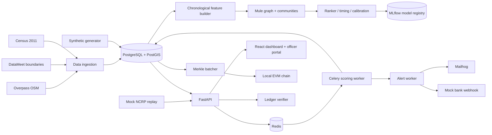

# ATM-Sentinel Prototype Implementation Plan

## Scope

This document is the build specification for the prototype only. It covers S1-S9:

- S1 Data foundation
- S2 Graph features and candidate generation
- S3 Ranking, calibration, timing, explanations, and evaluation
- S4 API, workers, replay, and mock bank integration
- S5 Geospatial risk dashboard
- S6 Officer portal and evidence dossier
- S7 Alerts and escalation
- S8 Security and DevOps
- S9 Blockchain anchoring and verification

The prototype is a demonstrable vertical slice, not a production banking or law-enforcement system. External data, fraud labels, bank integrations, SMS delivery, blockchain anchoring, and NCRP ingestion are mocked or sandboxed unless explicitly stated otherwise.

## Prototype Definition Of Done

A clean environment can:

1. Load ATM and administrative boundary data for 6-8 Indian states, map records to H3 resolution 6, and persist the normalized data.
2. Generate a reproducible 12-month synthetic complaint and transaction dataset with noise, new gangs, and month-7 drift.
3. Train with months 1-8, validate on month 9, test on month 10, and retrain/demo on months 11-12 without temporal leakage.
4. Score a complaint in under 2 seconds in the local Docker profile, including candidate generation, ranking, calibration, timing, decisioning, and persistence.
5. Show live and historical risk on the dashboard, filter by state/crime/amount/time, and drill into a zone and ATM.
6. Let an officer inspect alerts, acknowledge them, submit useful/false feedback, inspect a mule chain, and export a hashed evidence dossier with a QR code.
7. Enforce role and state/bank visibility rules, encrypt and hash account identifiers, append hash-chained audit events, and expose a tamper-verification path.
8. Demonstrate a Merkle batch anchor on a local Hardhat or Ganache chain and display VERIFIED or TAMPERED in the UI.

## Target Repository Shape

Keep the existing React/Vite app as the frontend and add a sibling backend and data/ML workspace:

```text
atm-crime-officer-portal/
  frontend files already in src/
  backend/
    app/
      main.py
      config.py
      db.py
      models.py
      schemas.py
      auth.py
      dependencies.py
      routers/
        auth.py
        complaints.py
        predictions.py
        zones.py
        alerts.py
        accounts.py
        reports.py
        ledger.py
        websocket.py
      workers/
        scoring.py
        alerts.py
        anchoring.py
      services/
        crypto.py
        audit.py
        scoring.py
        notifications.py
        ledger.py
    tests/
  data/
    raw/
    normalized/
    generated/
    manifests/
  ml/
    features.py
    graph.py
    candidates.py
    train_ranker.py
    calibrate.py
    timing.py
    explain.py
    evaluate.py
    retrain.py
  scripts/
    fetch_geography.py
    generate_synthetic.py
    replay_ncrp.py
    tamper_demo.py
  contracts/
    Anchor.sol
  infra/
    docker-compose.yml
    Dockerfile.backend
    Dockerfile.worker
  docs/
    PROTOTYPE_IMPLEMENTATION_PLAN.md
```

The current frontend mock services remain useful during backend development. Replace them behind the existing `apiService` and `websocketService` interfaces once the local API is available.

## Architecture



### Local service profile

| Service | Default port | Responsibility |
| --- | ---: | --- |
| frontend | 5173 | React/Vite dashboard and officer portal |
| api | 8000 | FastAPI REST and WebSocket API |
| worker | n/a | Celery scoring, alert, escalation, anchor jobs |
| postgres | 5432 | PostGIS operational data and audit trail |
| redis | 6379 | Celery broker, deduplication, short-lived state |
| mailhog | 8025 / 1025 | Prototype email capture |
| hardhat | 8545 | Local EVM chain |
| mlflow | 5000 | Experiment and model registry |

## S1: Data Foundation

### 1.1 Geography ingestion

Implement `scripts/fetch_geography.py` with:

- Overpass requests for ATM and bank nodes in 6-8 states. Start with Maharashtra, Delhi, Karnataka, Telangana, Tamil Nadu, West Bengal, Gujarat, and Uttar Pradesh.
- Retry with exponential backoff, a request timeout, a local raw response cache, and a manifest containing source URL, retrieval time, query hash, and record count.
- DataMeet state and district shapefiles normalized to EPSG:4326 and stored as GeoPackage or GeoJSON in `data/normalized/`.
- Deduplication by source ID first, then a small coordinate/name proximity rule for records without a stable source ID.
- No personal or account data in this stage.

Outputs:

```text
data/raw/overpass_<state>_<date>.json

data/normalized/atms.parquet

data/normalized/states.geojson

data/normalized/districts.geojson

data/manifests/geography_manifest.json
```

### 1.2 H3 zone mapping

For every ATM:

- Compute an H3 resolution-6 index from latitude/longitude.
- Spatially join state and district using the boundary polygons.
- Attach Census 2011 population and a population weight to the zone.
- Materialize zone boundary geometry and center point for the dashboard.
- Reject invalid coordinates and retain a quarantine report.

Required invariants:

- Every accepted ATM has exactly one state, district, and H3 index.
- Every zone has a stable ID, boundary, population, and ATM count.
- H3 geometry is generated from the index, not hand-authored map polygons.

### 1.3 PostgreSQL/PostGIS schema

Use SQLAlchemy models and Alembic migrations. Minimum tables:

| Table | Required columns |
| --- | --- |
| `zones` | `h3_index` PK, state, district, geometry, population, atm_count |
| `atms` | id, terminal_id, bank_id, zone_id, location, status, daily_volume |
| `accounts` | account_hash PK, encrypted_account, bank_id, holder_ciphertext, created_at |
| `complaints` | id, received_at, crime_type, state, amount, source, payload_json |
| `transactions` | id, occurred_at, source_account_hash, target_account_hash, amount, channel |
| `withdrawals` | id, occurred_at, account_hash, atm_id, amount, reference_hash |
| `predictions` | id, complaint_id, zone_id, probability, timing_score, decision, model_version |
| `alerts` | id, prediction_id, dedup_key, priority, status, acknowledged_at |
| `audit_log` | id, event_time, actor_id, action, object_type, object_id, payload_json, prev_hash, event_hash |
| `ledger_anchors` | id, batch_start, batch_end, merkle_root, chain_id, tx_hash, status |

Use PostGIS `Geometry(POINT, 4326)` and `Geometry(POLYGON, 4326)`. Add indexes on `complaints.received_at`, `predictions.zone_id`, `alerts.status`, `transactions` account columns, and GIST indexes on geographic columns.

### 1.4 Synthetic data generator

Implement `scripts/generate_synthetic.py` with a fixed seed and a versioned manifest.

Generate:

- 12-15 gangs with 3-6 tiers and shared mule accounts.
- 60,000-100,000 complaints.
- 15% label and feature noise.
- 10% newly appearing gangs after the training period.
- A distribution drift event at month 7.
- NCRB-inspired state and crime-type mix.
- Withdrawals and transactions with realistic timestamps, amounts, channels, and account reuse.
- A small set of clean negatives to keep candidate recall measurable.

Store ground truth separately from model-visible features. Generated data must include `dataset_version`, `seed`, and `generated_at` in its manifest.

### 1.5 Time split

Use calendar month derived from `received_at`:

| Split | Months | Use |
| --- | --- | --- |
| Train | 1-8 | Feature/ranker training and Optuna trials |
| Validation | 9 | Calibration, threshold selection, early stopping |
| Test | 10 | Final evaluation only |
| Retrain demo | 11-12 | Promote-if-better demonstration |

The feature builder must never read future complaints, transactions, withdrawals, labels, or aggregate counters when constructing a row.

## S2: Graph And Candidate Generation

### 2.1 Mule graph and communities

Implement `ml/graph.py`:

- Build a directed weighted graph from transactions and withdrawals.
- Keep edge amount, count, first-seen, last-seen, and channel aggregates.
- Run Louvain community detection on the undirected projection for community features.
- Version the graph snapshot by cutoff timestamp.
- For each scoring event, use only edges whose timestamps are at or before the complaint timestamp.

### 2.2 Chronological feature store

Implement `ml/features.py` as an append-only chronological builder. Counters update only after the current complaint is fully featurized and labeled.

Minimum features:

- `mule_zone_count`
- `community_zone_share`
- prior complaint count by zone and crime type
- withdrawal velocity over 1h, 6h, and 24h
- unique accounts and ATMs in the prior windows
- amount statistics and burst indicators
- graph degree, community size, and cross-zone flow share
- population-normalized zone activity

Persist feature rows with `as_of_time`, `source_window_start`, `source_window_end`, and `feature_version` for auditability.

### 2.3 Candidate generator

Implement a recall-first generator that returns about 40 zones per complaint:

- union of recent complaint zones, graph-linked zones, nearby H3 neighbors, and top historical zones;
- deterministic fallback to the highest-prior zones if fewer than 40 candidates exist;
- candidate ordering independent of the final ranker;
- evaluation of `recall@40` on the test month, target above 90%.

Candidate generation is allowed to over-include. It must not use the true target zone or post-complaint activity.

## S3: ML And Decisioning

### 3.1 Baseline

Implement an always-top-zone baseline trained on the training split. Record its metrics before adding any learned model. XGBoost is optional and should only be added after the baseline and LightGBM path are working.

### 3.2 Ranking rows

Create one row per `(complaint, candidate_zone)` with:

- complaint metadata available at receipt time;
- chronological features from S2;
- binary relevance label for the true zone;
- candidate rank metadata;
- split and timestamp metadata.

Never include future resolution, post-complaint withdrawals, or target-derived aggregates.

### 3.3 LightGBM LambdaRank

Train a LightGBM LambdaRank model grouped by complaint ID.

- Start with approximately 20 Optuna trials.
- Optimize validation NDCG@3 while monitoring recall@40 and top-k metrics.
- Save feature names, hyperparameters, dataset version, git revision, and training time in MLflow.
- Register the best candidate only after evaluation and leakage tests pass.

### 3.4 Calibration

On validation month 9:

- Apply temperature-scaled softmax to candidate scores.
- Fit temperature without reading month 10.
- Save calibration parameters with the model artifact.
- Generate a reliability plot and Brier score.
- Reuse the exact calibration artifact during API scoring.

### 3.5 Timing model

Train a six-interval hazard model using true `(complaint, zone)` pairs only. The six intervals must be defined in code and recorded in the model manifest. Do not train timing on negative candidate pairs unless a separate, explicit survival formulation is added and tested.

### 3.6 Decision layer

Implement a pure, unit-tested Python function:

```text
input: calibrated_probability, timing_score, feature quality flags
output: CRITICAL | HIGH | WATCH
```

Initial thresholds are configuration, not constants hidden in code. The validation split selects thresholds subject to alert-volume and recall constraints. Store the threshold version in every prediction.

### 3.7 SHAP explanations

Compute SHAP values only for `CRITICAL` alerts. Return the top reasons with feature name, direction, value, and confidence bucket. Do not expose raw account identifiers or unapproved features in reasons.

### 3.8 Evaluation

Implement `ml/evaluate.py` and log to MLflow:

- recall@40
- Top-1, Top-3, Top-5 accuracy
- NDCG@3
- Brier score
- calibration/reliability plot
- alert volume by decision
- ablation table for graph, candidate, timing, and calibration features
- latency p50/p95 for candidate generation and full scoring

All metrics must identify dataset version, model version, split, and random seed.

### 3.9 Leakage tests

Implement pytest tests for:

- no feature source timestamp is after complaint time;
- counters do not include the current complaint before featurization;
- validation and test rows do not affect training aggregates;
- timing rows are true pairs only;
- candidate generation never reads labels;
- calibration uses validation only;
- test metrics are not used to select thresholds.

## S4: Backend

### 4.1 Authentication and roles

FastAPI with JWT access tokens, bcrypt password hashes, and seeded local users:

- `I4C_ADMIN`: unrestricted prototype administration;
- `STATE_OFFICER`: only assigned state data and unmasked law-enforcement case data permitted by policy;
- `BANK_OFFICER`: assigned bank data with account and cross-bank fields masked.

JWT claims contain subject, role, state scope, bank scope, issued-at, and expiry. Never put account numbers or full case payloads in tokens.

### 4.2 Complaint intake

`POST /complaints`:

1. Validate the request with Pydantic.
2. Normalize timestamps, amounts, state, and crime type.
3. HMAC-hash account identifiers for lookup.
4. Encrypt account numbers and other protected values with AES-256-GCM.
5. Store the complaint and an audit event.
6. Enqueue scoring using the complaint ID.
7. Return `202 Accepted` with correlation ID and status URL.

### 4.3 Scoring worker

Celery task sequence:

```text
load complaint -> load as-of graph/features -> generate candidates
-> rank -> calibrate -> timing -> decision -> critical SHAP
-> persist prediction -> deduplicate alert -> emit WebSocket event
```

Target full scoring latency is under 2 seconds locally for the prototype. Each task logs correlation ID, model version, feature version, and elapsed time. Retries must be idempotent.

### 4.4 Read endpoints

Minimum endpoints:

| Method | Endpoint | Purpose |
| --- | --- | --- |
| POST | `/auth/login` | Issue JWT |
| POST | `/complaints` | Validate and enqueue complaint |
| GET | `/predictions` | Filtered predictions and probabilities |
| GET | `/heatmap` | ATM/zone heatmap points |
| GET | `/zones` | Zone summaries and historical values |
| GET | `/zones/{h3_index}` | Zone drill-down |
| GET | `/alerts` | Role-filtered alert inbox |
| GET | `/alerts/{id}` | Alert detail and reasons |
| GET | `/accounts/{hash}/chain` | Role-filtered mule graph |
| GET | `/reports/{case_id}` | Evidence report metadata |
| GET | `/ledger/{object_type}/{object_id}/verify` | VERIFIED/TAMPERED result |

Use cursor pagination on alerts and audit-sensitive collections. Filters match the current frontend URL parameters: state, crime, minAmount, time, and mode.

### 4.5 Action endpoints

- `POST /alerts/{id}/ack`: acknowledge with actor and timestamp.
- `POST /alerts/{id}/feedback`: useful/false plus reason.
- `POST /accounts/{hash}/freeze`: prototype account freeze action with authorization and audit event.
- `POST /reports/{case_id}/export`: generate an evidence manifest and PDF job status.

All mutations are idempotent where a client retry is likely.

### 4.6 WebSocket

`GET /ws/alerts` authenticates before accepting the socket. Push event types:

- `ALERT_NEW`
- `ZONE_RISK_UPDATE`
- `ATM_STATUS_CHANGE`
- `HEARTBEAT`

The frontend keeps its current simulation fallback for offline UI development. Production-like local mode uses the backend socket.

### 4.7 Mock NCRP replay

`scripts/replay_ncrp.py` reads test-month complaints in timestamp order, posts them to `/complaints`, supports configurable speed, and records accepted IDs and API latency. It must support pause/resume and deterministic replay from a seed or manifest.

### 4.8 Mock bank service

FastAPI service with:

- `POST /webhooks/hold-request`;
- HMAC signature validation;
- idempotency key handling;
- configurable delay, failure, and retry responses;
- received payload audit log.

### 4.9 Retraining

`scripts/retrain.py` trains on months 1-11 or 1-12 according to the demo flag, evaluates against the existing champion, and promotes only when configured primary metrics improve without breaching latency or calibration guardrails. Every promotion is recorded in MLflow.

## S5: Dashboard

The existing React dashboard is the prototype shell. Complete it against the backend contract:

- MapLibre GL basemap with attribution and Deck.gl ATM points.
- H3 resolution-6 risk polygons colored by calibrated probability.
- Live and Historical modes with a time scrubber.
- URL-synchronized state, crime type, amount, and time filters.
- Heatmap toggle using `/heatmap`.
- Zone drill-down with top zones, alert count, probability trend, modus operandi, ATM list, and dispatch action.
- WebSocket updates that merge predictions without duplicating alert IDs.
- Loading, empty, error, reconnecting, and permission-denied states.

Frontend data access should retain the current `apiService` interface and add a `VITE_API_BASE_URL` configuration. React Query can be introduced when the live API replaces the in-memory mock service.

## S6: Officer Portal

- Alert inbox with search, status tabs, priority, probability, suspected amount, and timestamp.
- Alert detail with zone, ATM, calibrated probability, timing, SHAP reasons for Critical alerts, telemetry, and audit state.
- Acknowledge and useful/false actions with optimistic UI only after the API accepts the mutation.
- Mule chain graph from `/accounts/{hash}/chain`; mask account, holder, bank, IFSC, and IP fields for bank users.
- Evidence dossier with canonical manifest hash, audit chain hash, QR verification URL, and printable PDF layout.
- Display ledger anchor ID, transaction hash, and VERIFIED/TAMPERED status when available.
- SMS is a rendered template only; no real SMS provider is connected in the prototype.

## S7: Alerts

### 7.1 Routing and deduplication

For every prediction:

- map `CRITICAL`, `HIGH`, and `WATCH` to configured recipients;
- deduplicate on `(zone_id, 30-minute bucket)` for the same incident family;
- store a dedup key and decision reason;
- make delivery idempotent.

### 7.2 Email and dashboard popup

Use Mailhog SMTP locally. Email templates include alert ID, priority, zone, probability, action link, and verification metadata. Do not include protected account numbers in email.

### 7.3 Bank webhook

Send an HMAC-SHA256 signed hold-request payload over `httpx`. Include timestamp, nonce, idempotency key, alert ID, zone, amount band, and requested action. Retry with bounded exponential backoff and dead-letter after the configured limit.

### 7.4 SMS mock

Render a concise SMS preview in the officer UI for the recipient and priority. Mark it clearly as mocked and do not call a provider.

### 7.5 Critical escalation

Celery Beat checks unacknowledged Critical alerts every minute. At five minutes, re-send through the configured channels once per escalation stage and append an audit event. Stop escalation when acknowledged, resolved, or false positive.

## S8: Security And DevOps

### 8.1 Authorization

Centralize FastAPI dependencies for authenticated user, role, state scope, and bank scope. Apply checks to every read and mutation endpoint. Add tests for cross-state, cross-bank, masked-field, expired-token, and missing-scope access.

### 8.2 Protected identifiers

- AES-256-GCM for account numbers and protected payload fields.
- HMAC-SHA256 with a server-side lookup key for deterministic account lookup.
- Separate encryption and HMAC keys in environment variables.
- Key IDs stored with ciphertext so rotation can be demonstrated.
- Logs redact account values, JWTs, webhook secrets, and raw complaint payloads.

### 8.3 Hash-chained audit log

Canonicalize audit JSON with sorted keys and compact separators. Compute:

```text
hash_i = SHA256(canonical_event_i || prev_hash_i-1)
```

Verify continuity by object, actor, and time range. Any modified event or deleted link returns `TAMPERED`.

### 8.4 Docker Compose

Provide services for frontend, API, worker, beat, PostgreSQL/PostGIS, Redis, Mailhog, MLflow, and a local EVM chain. Health checks must gate API and workers on Postgres/Redis readiness. Use `.env.example`; never commit development secrets.

### 8.5 Tests and latency

- `pytest` unit tests for crypto, audit, feature leakage, decision thresholds, API validation, RBAC, deduplication, and webhook signatures.
- API integration tests against a temporary Postgres database.
- One Locust run for complaint intake and alert reads, with p50/p95 output captured in `reports/`.
- One replay run proving the under-2-second scoring target under the prototype load profile.

## S9: Blockchain

### 9.1 Canonical hashing

Hash canonical JSON for predictions, alerts, acknowledgements, and feedback. Canonical JSON must be versioned and include object type, object ID, schema version, and created timestamp.

### 9.2 Merkle batcher

Every 60 seconds:

1. Select unanchored object hashes in stable ID order.
2. Build a binary Merkle tree with deterministic odd-node duplication.
3. Save root, leaf order, proofs, time window, and batch ID in `ledger_anchors`.
4. Submit the root to the anchor worker.

Critical alerts request immediate anchoring; they may also be included in the next regular batch only once.

### 9.3 Smart contract

`contracts/Anchor.sol` stores:

- root;
- batch ID;
- submitted timestamp;
- submitter;
- optional metadata hash.

Expose `anchorRoot(bytes32 batchId, bytes32 root)` and a read method for verification. Reject duplicate batch IDs.

### 9.4 Async anchor worker

Use `web3.py` and Celery. If the chain is down, retain a durable queued status, retry with backoff, and never mark an object verified merely because its local root was created.

### 9.5 Verifier API and page

Verification must:

- recompute the object hash;
- load its Merkle proof and root;
- compare the stored root with the chain root;
- return `VERIFIED`, `TAMPERED`, `NOT_ANCHORED`, or `CHAIN_UNAVAILABLE`.

The React page displays object ID, batch ID, root, proof result, chain ID, and transaction hash.

### 9.6 PDF badge and QR

The evidence PDF includes a verified badge only for a chain-confirmed anchor. The QR code points to the verifier endpoint with object ID and anchor ID. Local-only or pending states must be labeled accordingly.

### 9.7 Tamper demo

`scripts/tamper_demo.py` changes one stored alert field after anchoring, runs verification, and prints `TAMPERED`. The script then restores the fixture database or operates on an isolated demo copy.

## Dataset Register

| Dataset | Used by | Purpose |
| --- | --- | --- |
| OpenStreetMap / Overpass | S1.1 | Real ATM and bank locations |
| DataMeet shapefiles | S1.1-S1.2 | State and district boundaries |
| Census 2011 | S1.2 | Population weights |
| NCRB Crime in India | S1.4 | State-wise complaint mix |
| PaySim / Bank Account Fraud | S1.4 | Behavior ideas only; do not load directly |
| Synthetic dataset | S1.4-S7, S9 | All training, evaluation, replay, and demo flows |

Record source licenses, retrieval dates, transformations, and checksums in data manifests.

## Delivery Order

### Milestone 1: Data and storage

- Geography ingestion and H3 normalization.
- SQLAlchemy models, migrations, seed users, and synthetic generator.
- Reproducible time split and data manifests.

### Milestone 2: Scoring proof

- Chronological features, graph communities, candidates, baseline, ranker, calibration, timing, decision function.
- Evaluation report and leakage tests.
- MLflow artifact registration.

### Milestone 3: API and eventing

- JWT/RBAC, complaint intake, scoring worker, read/action endpoints, WebSocket, replay, mock bank, Mailhog.
- API and RBAC integration tests.

### Milestone 4: UI integration

- Replace mock reads with API reads while retaining offline simulation.
- Complete loading/error/permission states.
- Validate dashboard, alert inbox, case graph, evidence report, and live updates.

### Milestone 5: Integrity and operations

- Hash-chained audit, Merkle batches, local chain, verifier page, PDF badge, tamper demo.
- Docker Compose health checks and one Locust run.

## Verification Checklist

```text
[ ] npm run build
[ ] frontend can run with mock services offline
[ ] geography manifest and normalized files exist
[ ] synthetic generation is reproducible from its seed
[ ] train/validation/test timestamps are disjoint
[ ] leakage pytest suite passes
[ ] recall@40 target is reported
[ ] ranker, calibration, timing, and threshold versions are persisted
[ ] complaint intake returns 202 and a correlation ID
[ ] scoring p95 is below 2 seconds in the local profile
[ ] role and state/bank filters pass API tests
[ ] bank role receives masked chain data
[ ] duplicate alerts are suppressed for the 30-minute zone window
[ ] Critical escalation re-sends after five minutes
[ ] webhook rejects invalid HMAC signatures
[ ] audit tampering returns TAMPERED
[ ] local Merkle root is stored with proofs
[ ] chain-confirmed object returns VERIFIED
[ ] modified anchored object returns TAMPERED
[ ] PDF contains audit hash, QR, and truthful ledger status
[ ] Locust latency report is saved
```

## Current Frontend Mapping

The existing frontend already provides a useful prototype surface:

- `src/App.tsx`: dashboard, officer, split navigation, live updates, actions, and modal orchestration.
- `src/services/apiService.ts`: in-memory contract adapter for zones, ATMs, alerts, cases, acknowledgement, feedback, and evidence hashing.
- `src/services/websocketService.ts`: backend WebSocket attempt with a local simulation fallback.
- `src/components/dashboard/`: MapLibre/Deck.gl map, filters, zone analytics, and drill-down.
- `src/components/officer/`: alert inbox, detail modal, mule graph, evidence dossier, and feedback dialog.
- `src/types/index.ts`: frontend contracts that should be mirrored by FastAPI response schemas.

When backend work begins, preserve these public frontend types and swap the service implementation behind them. This keeps the current demo usable while the data and scoring services are built incrementally.
